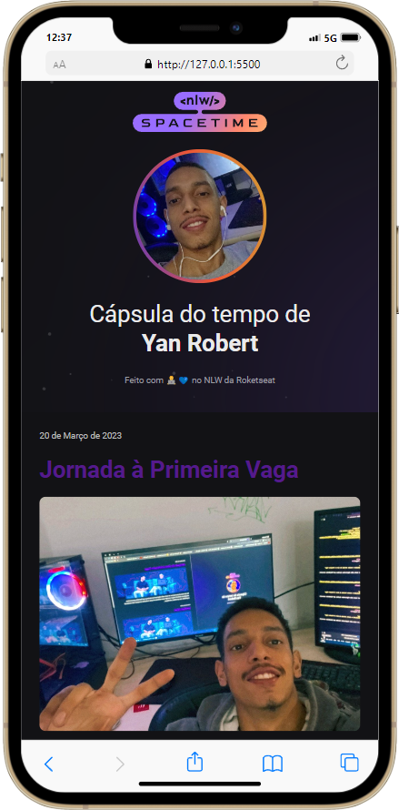

<h1 align="center">
    <p>Cápsula do Tempo ⏳🌎</p>


</h1>

<h1 align="center">
    <a href="https://yanrobert10.github.io/nlw-spacetime/">
    
    </a>
</h1>

## 📕 Sobre

**Cápsula do Tempo** foi um projeto desenvolvido para ir para o proximo nivel, melhorando as tecnicas de desenvolvimento usando html e css
## 🔨 Ferramentas Usadas

  <br/>

  []()

  []()


## ♻️ Como Contribuir

```bash
  # Clonar o Projeto
  $ git clone https://github.com/yanrobert10/nlw-spacetime.git

```


## Licença
 Este projeto está sob licença MIT. Veja o arquivo
[LICENSE](./LICENSE) para mais detalhes.


